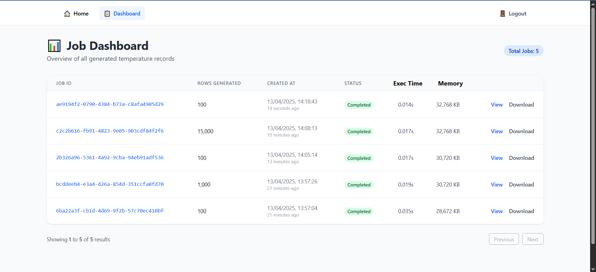
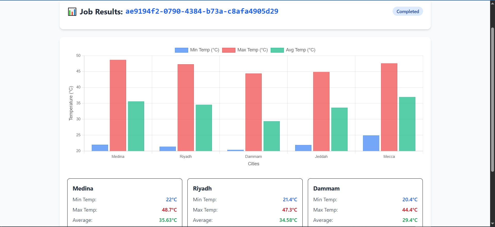

# Qanoniah Frontend

This is the frontend part of the Qanoniah full-stack challenge built with Vue 3, Vue Router, and Tailwind CSS.

## 🚀 Installation Guide (Frontend)

Follow these steps to run the frontend locally:

---

### 1. Clone the Repository

```bash
git clone https://github.com/faisal-sameer/qanoniah-frontend.git
cd qanoniah-frontend
```

---

### 2. Install Dependencies

```bash
npm install
```

---

### 3. Tailwind Setup

Tailwind CSS is already installed. Config files:

- `tailwind.config.js`
- `postcss.config.js`

Check for classes in `src/assets/main.css`:

```css
@tailwind base;
@tailwind components;
@tailwind utilities;
```

---

### 4. Axios Setup

The Axios instance is located at `src/axios.js`:

```js
import axios from 'axios'

const instance = axios.create({
  baseURL: 'http://127.0.0.1:8000/api',
  withCredentials: true,
  headers: {
    Accept: 'application/json',
    'Content-Type': 'application/json',
  },
})

export default instance
```

---

### 5. Run the Development Server

```bash
npm run dev
```

---

### 6. Available Routes

| Route             | Description               |
|------------------|---------------------------|
| `/login`          | Login page                |
| `/register`       | Register page             |
| `/`               | Home (submit job)         |
| `/progress/:id`   | Show job progress         |
| `/result/:id`     | Result with chart display |
| `/dashboard`      | Show all jobs             |

---

### 7. Notes

- Make sure Laravel backend is running at `http://127.0.0.1:8000`
- Authenticated routes are protected using Vue Router guards

---

### 📸 UI Screenshots

#### 🧩 Dashboard View



#### 📊 Result Chart



---

### 🎉 Done!

You're now ready to use the Qanoniah frontend.
